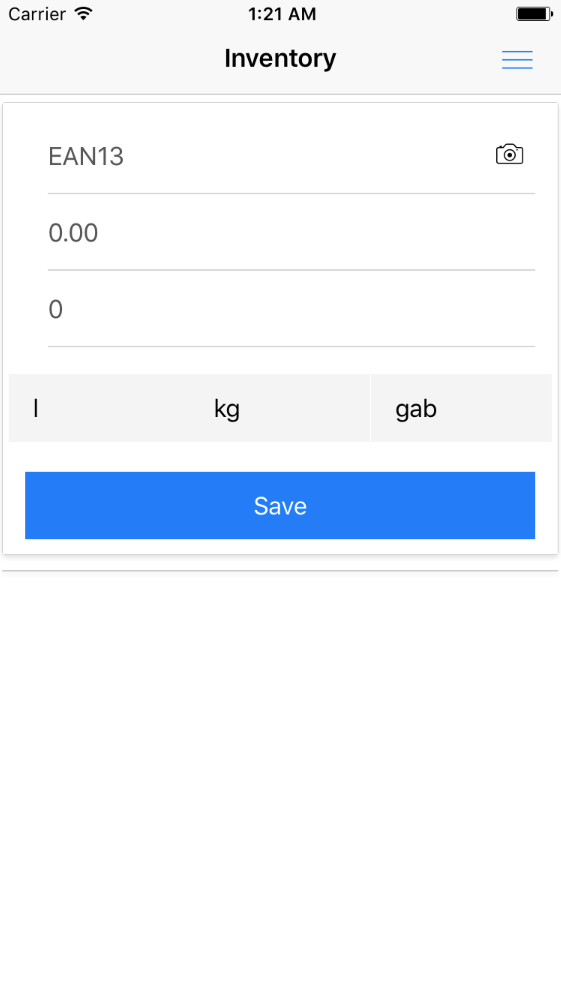

# Inventarizacija (application for inventory)

An application to inventory whatever and anywhere You want.

## Installation


Currently it available only for *alpha* testing, due early development stage.
But, as always You can build it at your own risk.

```bash
npm install
rnpm link
npm run android_release or ios
```

## Usage

1. Enter EAN13 code or scan it with camera
2. Enter price and amount
3. Choose measurement

 

After editing, You can synhronize all of Your data with **inventory.csv** file.

## Contribute

- Create issues
- Share your wishes
- Send to us pull requests

The only advice is to use Git Flow, ESLint and EditorConfig – for clean code.

```bash
npm run test
```

Read [more](http://facebook.github.io/react-native/docs/getting-started.html) about [React Native](https://github.com/facebook/react-native)
